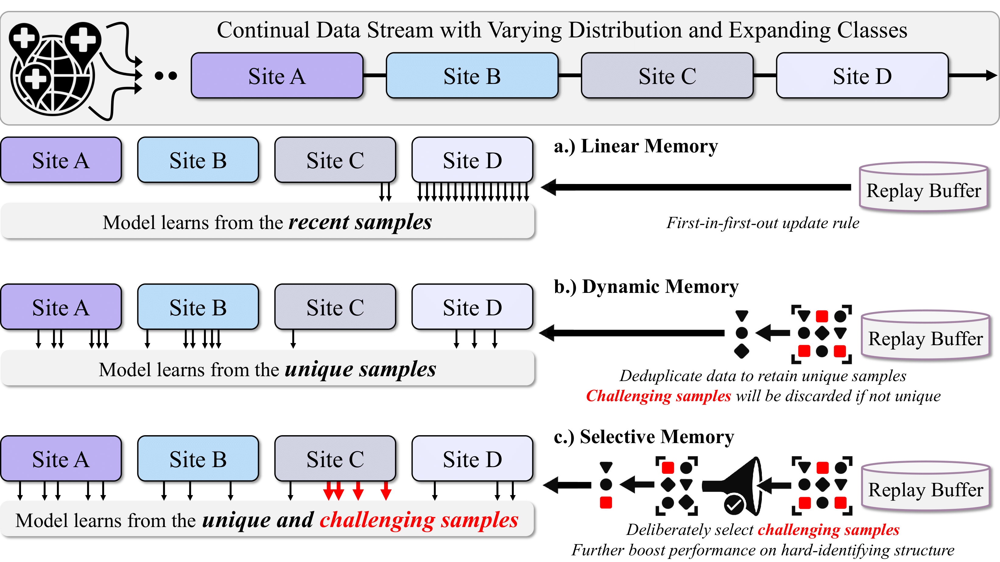
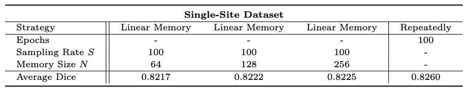
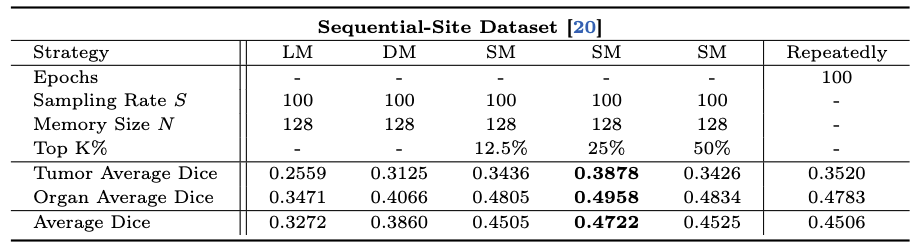
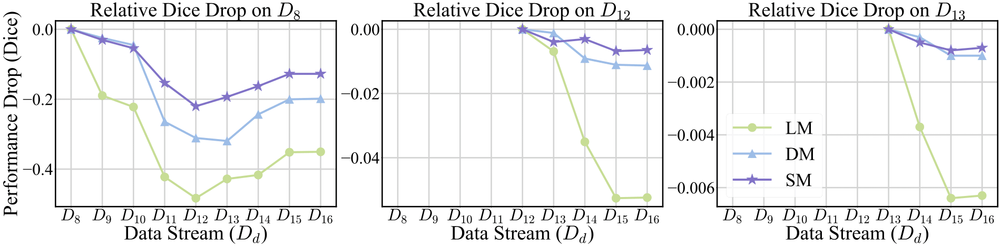
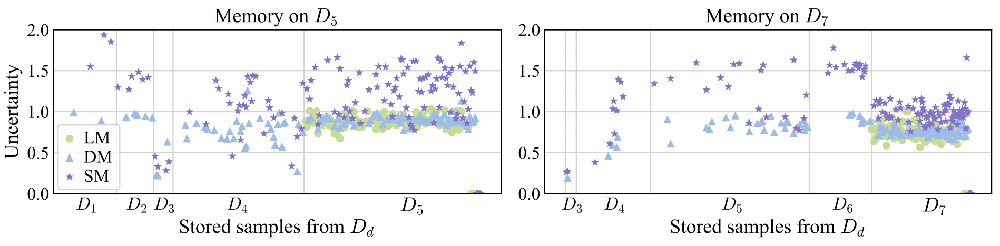

# <p align=center>Embracing Massive Medical Data</p><!-- omit in toc -->

## Paper
<b>Embracing Massive Medical Data</b> <br/>
[Yu-Cheng Chou](https://scholar.google.com/citations?user=YVNRBTcAAAAJ), [Zongwei Zhou](https://www.zongweiz.com/), and [Alan L. Yuille](https://www.cs.jhu.edu/~ayuille/) <br/>
Johns Hopkins University,   <br/>
MICCAI, 2024 <br/>
[paper](https://www.cs.jhu.edu/~alanlab/Pubs24/chou2024embracing.pdf) | [code](https://github.com/MrGiovanni/OnlineLearning)


<p align="center">
     <br />
    <em> 
    Figure 1: Different Training Method. Linear memory stores only a few recent samples, causing significant forgetting. Dynamic memory adapts to varying data distributions by retaining unique samples, while selective memory further identifies and selects challenging samples, including those that might be duplicated, ensuring they are not missed by dynamic memory
    </em>
</p>

## 0. Installation
```bash
conda create -n massive python=3.9
source activate massive
pip install torch==1.11.0+cu113 torchvision==0.12.0+cu113 torchaudio==0.11.0 --extra-index-url https://download.pytorch.org/whl/cu113
pip install monai[all]==0.9.0
pip install -r requirements.txt

wget https://www.dropbox.com/s/lh5kuyjxwjsxjpl/Genesis_Chest_CT.pt
```
## 1. Dataset

We adopt two large-scale CT datasets in our experiments, including a [single-site private dataset](https://www.medrxiv.org/content/medrxiv/early/2022/09/25/2022.09.24.22280071.full.pdf)  and a [sequential-site dataset](https://github.com/ljwztc/CLIP-Driven-Universal-Model.git). To download the sequential-site dataset, please see the [Datasets](https://github.com/ljwztc/CLIP-Driven-Universal-Model/blob/49715510829946f09f8330bd3a6e7b02e9fd51de/README.md?plain=1#L35) and [Dataset Pre-Process](https://github.com/ljwztc/CLIP-Driven-Universal-Model/blob/49715510829946f09f8330bd3a6e7b02e9fd51de/README.md?plain=1#L83) setction to create training and testing data.

## 2. Train the model
```bash
CUDA_VISIBLE_DEVICES=0,1,2,3 python -W ignore -m torch.distributed.launch --nproc_per_node=4 --master_port=1234 train.py
``` 


## 3. Test the model
```bash
CUDA_VISIBLE_DEVICES=0 python -W ignore test.py
``` 

## 4. Results


<p align="center">
     <br />
    <em> 
    Table 1: Data Efficiency. The results demonstrate that the linear memory trained on continual data streams achieves comparable performance to the prevalent training paradigm that trains models repeatedly with 100 epochs. Linear memory enables training without the need to revisit old data, thereby enhancing data efficiency.
    </em>
</p>


<p align="center">
     <br />
    <em> 
    Table 2: Dynamic Adaptation. Under the varying distributions in the streaming source, Dynamic Memory (DM) and Selective Memory (SM) enable the identification of the significant samples and thereby enhance the segmentation performance.
    </em>
</p>


<p align="center">
     <br />
    <em> 
    Figure 2: Catastrophic Forgetting. To evaluate forgetting, we calculate the relative Dice drop after training on the incoming sub-datasets. Both Dynamic Memory (DM) and Selective Memory (SM) store samples from previous sub-datasets, thereby alleviating forgetting observed with LM.
    </em>
</p>


<p align="center">
     <br />
    <em> 
    Figure 3: Diverse Memory. We visualize the memory to demonstrate the diversity of stored samples from previous $D_d$. Both Dynamic Memory (DM) and Selective Memory (SM) can retain the samples from previous sub-datasets. Selective Memory (SM) can further identify samples with higher uncertainty.
    </em>
</p>


## Acknowledgement

This work was supported by the Lustgarten Foundation for Pancreatic Cancer Research and partially by the Patrick J. McGovern Foundation Award.